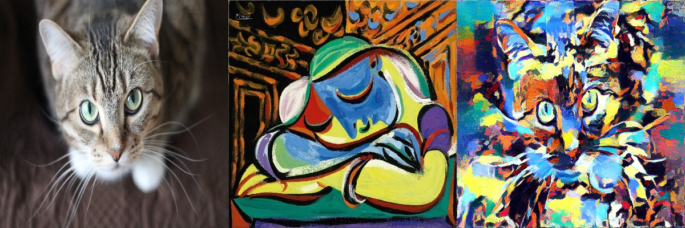
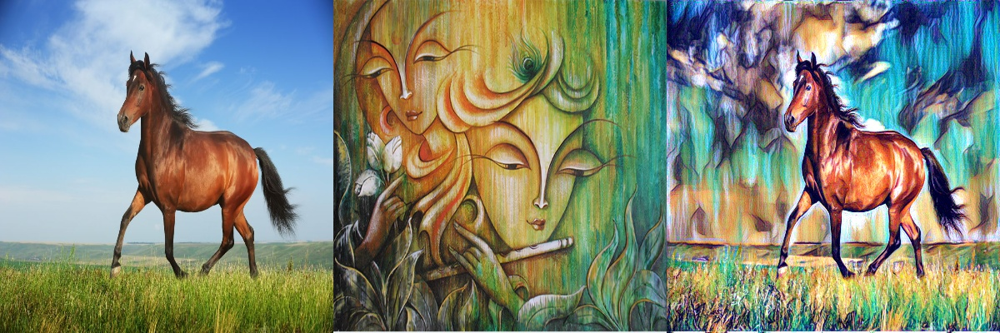
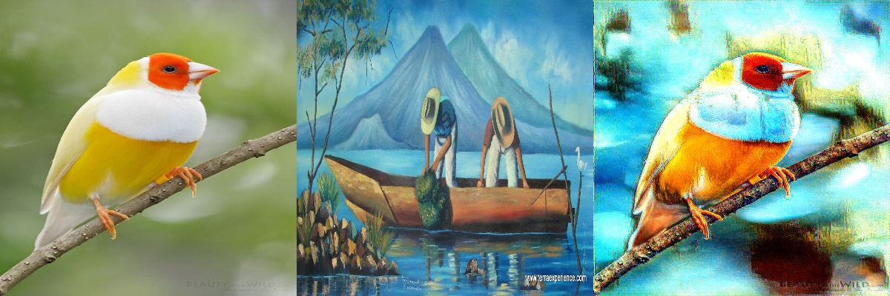

#PyTorch implementation of the paper "A Neural Algorithm of Artistic Style by Gatys et. al". 
##Link to the original paper: https://arxiv.org/pdf/1508.06576.pdf
##The problem is to take two images, extract content from one image, style(texture) from the other and seamlessly merge them together into one final image that looks realistic.
###Results from the implementation(left:content img, middle:style img, right: output img)

